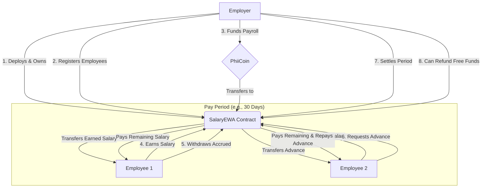

# System Design

## Architecture
The system is designed around a central `SalaryEWA` smart contract that acts as a trustless payroll intermediary between an employer and its employees. The employer funds the contract with a specific ERC20 token (`PhiiCoin`), and employees can withdraw their earned salary in a continuous stream.

The core components are:
- **Employer (Owner):** The deployer of the contract and the sole entity authorized to perform administrative actions like registering employees and funding the payroll.
- **SalaryEWA Contract:** The on-chain logic that handles salary accrual, withdrawals, advances, and settlement. It holds the payroll funds in escrow.
- **Employees:** Addresses registered by the employer who can interact with the contract to access their earned wages.
- **PhiiCoin (ERC20 Token):** The currency used for all payroll operations.

### Token & Fund Flow
The flow of funds and interactions can be visualized as follows:

### Accrual Model
Salaries accrue on a **per-second basis**. The contract calculates an employee's real-time earnings based on their registered monthly salary and the time elapsed since the beginning of their current pay period. This streaming model ensures that the amount an employee has earned is always up-to-date and withdrawable at any moment.

## Flow Description

1.  **Admin Registers Employee:**
    - The contract `owner` calls `registerEmployee(employee_address, monthly_salary)`.
    - This adds the employee to the system, sets their monthly salary, and marks their pay period as starting from the current `block.timestamp`.

2.  **Admin Funds Contract:**
    - The `owner` calls `fund(amount)`, having first approved the contract to spend their `PhiiCoin` tokens.
    - The specified `amount` of tokens is transferred from the owner to the `SalaryEWA` contract. These funds are now available for payroll.

3.  **Employee Earns Salary Per Second:**
    - This is a passive process. The contract calculates an employee's earnings dynamically using the formula:
      `accrued = (monthlySalary * (block.timestamp - periodStart)) / payPeriodSeconds`
    - There is no active transaction required for accrual to happen.

4.  **Employee Withdraws Accrued Salary:**
    - The employee calls the `withdraw()` function.
    - The contract calculates their `available` amount: `totalAccrued - withdrawnInPeriod - outstandingAdvance`.
    - It checks for a positive balance and transfers the `available` amount of `PhiiCoin` to the employee.
    - The employee's `withdrawnInPeriod` counter is updated to reflect the withdrawal.

5.  **Employee Requests an Advance (Max 50%):**
    - The employee calls `requestAdvance(amount)`.
    - The contract first calculates the currently available withdrawable amount.
    - It verifies that the requested `amount` is no more than 50% of this available amount (`maxAdvance = availableForAdvance / 2`).
    - It also ensures the employee has not already taken an advance in the current pay period.
    - If valid, the `amount` is transferred to the employee, and their `outstandingAdvance` and `lastAdvancePeriod` are updated.

6.  **Employer Settles Salary at Period End:**
    - The `owner` calls `releaseSalary(employee_address)`.
    - The contract calculates the total remaining salary owed for the completed period.
    - It first uses this remaining amount to automatically repay any `outstandingAdvance`.
    - The final net salary is transferred to the employee.
    - The employee's state is reset for the next pay period (`periodStart` is updated, `withdrawnInPeriod` is zeroed).

7.  **Refund/Free-Funds Logic:**
    - The `owner` can call `refund(amount)` to withdraw excess funds.
    - To prevent draining funds owed to employees, the contract calculates the `_computeLockedAmount()`. This is the sum of all employees' net accrued salaries plus their outstanding advances.
    - The owner can only refund an `amount` that is less than or equal to `contract.balance - lockedAmount`.

## Data Model

### State Variables & Structs

| Variable             | Type            | Description                                                                                             |
| -------------------- | --------------- | ------------------------------------------------------------------------------------------------------- |
| `token`              | `IERC20`        | The immutable address of the ERC20 token used for payroll.                                              |
| `payPeriodSeconds`   | `uint256`       | The duration of a standard pay period in seconds (e.g., 30 days).                                       |
| `employees`          | `mapping`       | `address => Employee` struct, storing the data for each registered employee.                            |
| `employeeList`       | `address[]`     | An array of all employee addresses for iteration.                                                       |
| `totalFunded`        | `uint256`       | A counter for the total amount of tokens ever funded into the contract.                                 |
| `totalWithdrawn`     | `uint256`       | A counter for the total amount withdrawn by employees (including advances).                             |
| `totalRefunded`      | `uint256`       | A counter for the total amount refunded to the owner.                                                   |

### `Employee` Struct

| Field                | Type      | Description                                                                                             |
| -------------------- | --------- | ------------------------------------------------------------------------------------------------------- |
| `monthlySalary`      | `uint256` | The employee's salary for a full `payPeriodSeconds`, denominated in the token's smallest unit.          |
| `periodStart`        | `uint256` | The Unix timestamp when the employee's current pay period began.                                        |
| `active`             | `bool`    | A flag to indicate if the employee is currently active in the payroll system.                           |
| `withdrawnInPeriod`  | `uint256` | The cumulative amount the employee has withdrawn during the current pay period (excluding advances).      |
| `outstandingAdvance` | `uint256` | The amount of salary advance the employee owes, which will be deducted at settlement.                   |
| `lastAdvancePeriod`  | `uint256` | The index of the pay period in which the last advance was taken, to prevent multiple advances per period. |

### Formulas & Logic

-   **Accrual Formula:**
    `accrued = (monthlySalary * (block.timestamp - periodStart)) / payPeriodSeconds`
    This ensures a linear, continuous stream of earnings.

-   **Available to Withdraw Formula:**
    `available = accrued - withdrawnInPeriod - outstandingAdvance`
    This is the net amount an employee can pull at any given time.

-   **Advance Logic:**
    `maxAdvance = available / 2`
    An employee can borrow up to 50% of their currently withdrawable net earnings, but only once per pay period.

-   **Locked Funds Formula:**
    `locked = sum(remainingAccrued + outstandingAdvance)` for all active employees.
    This is a critical accounting mechanism to ensure the contract can always meet its obligations. `remainingAccrued` is the portion of the salary earned but not yet paid out.

## Security Considerations

The contract integrates several security best practices and patterns:

-   **Reentrancy Protection:** The `nonReentrant` modifier from OpenZeppelin's `ReentrancyGuard` is used on all functions that perform external calls and state changes (`fund`, `releaseSalary`, `withdraw`, `requestAdvance`, `refund`), preventing reentrancy attacks.

-   **Safe ERC20 Operations:** All token transfers use OpenZeppelin's `SafeERC20` library (`safeTransfer`, `safeTransferFrom`). This protects against token contracts that do not return a boolean `true` on success and handles potential reverts gracefully.

-   **Checks-Effects-Interactions Pattern:** State-changing variables are updated *before* the external call (token transfer) is made. For example, in `withdraw()`, `e.withdrawnInPeriod` is updated before `token.safeTransfer()`. This mitigates the risk of reentrancy even without the guard.

-   **Pausable Contract:** The contract inherits `Pausable` from OpenZeppelin, allowing the owner to halt all primary functions (`whenNotPaused` modifier) in case of an emergency or suspected vulnerability, while still allowing emergency withdrawals by the owner.

-   **Locked-Funds Accounting:** The `refund()` function includes a robust check to ensure the owner cannot withdraw funds that are already owed to employees (`contractBal - _computeLockedAmount() >= _amount`). This prevents insolvency and ensures payroll can always be met from the funded amount.

-   **Access Control:** The `onlyOwner` modifier restricts administrative functions to the employer, while the custom `onlyActiveEmployee` modifier ensures that only registered and active employees can access withdrawal functions.
